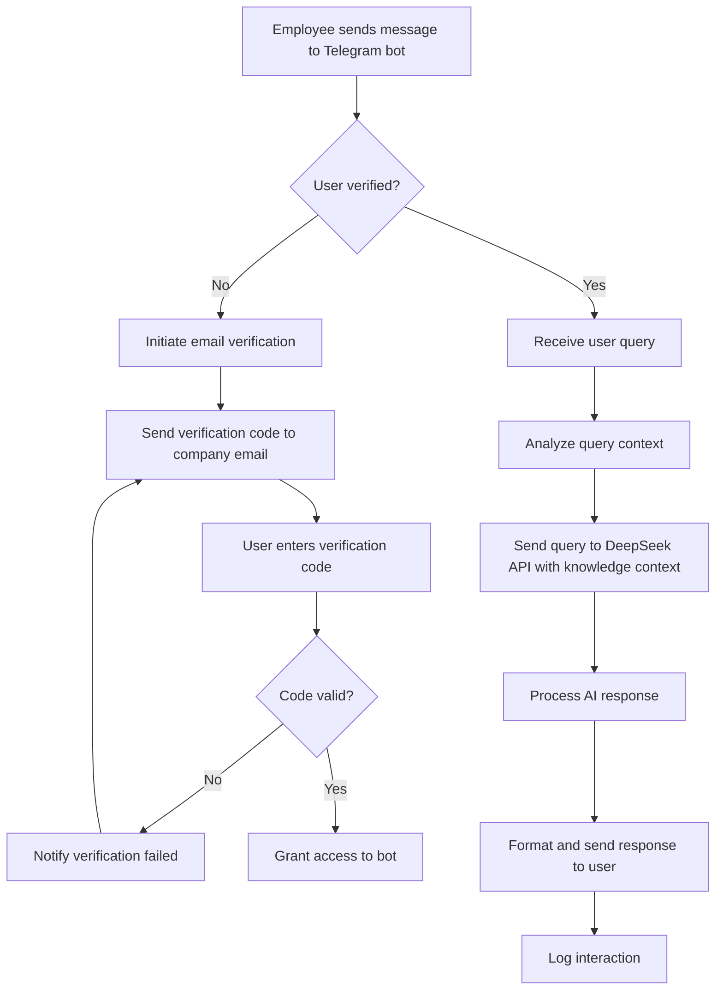
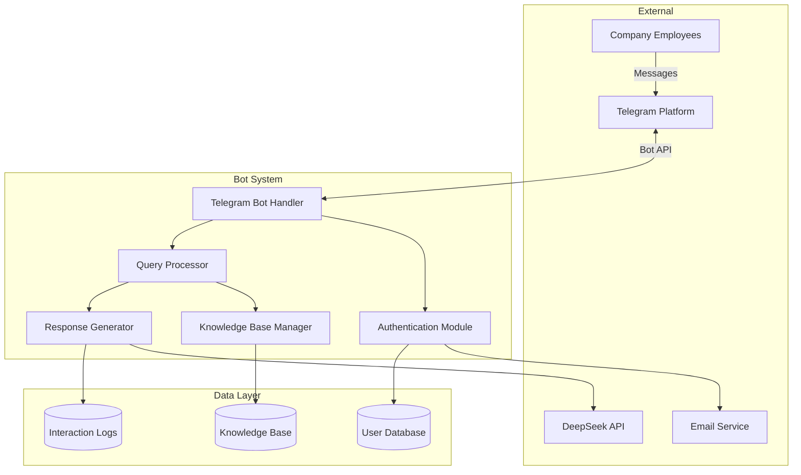
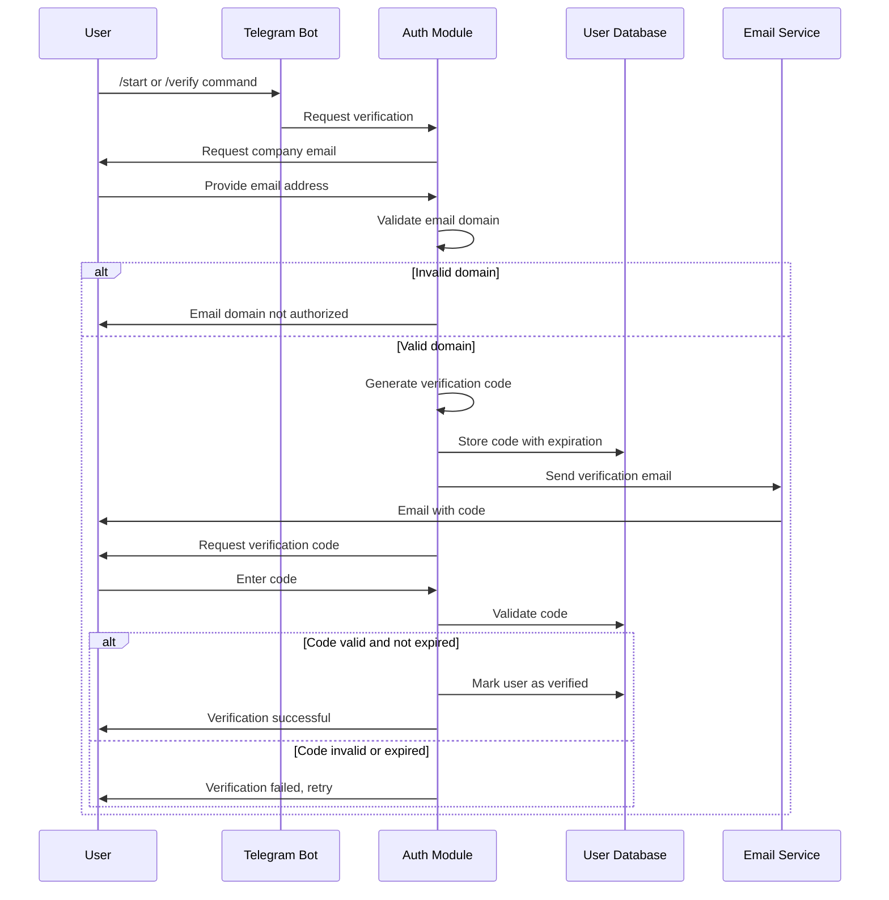
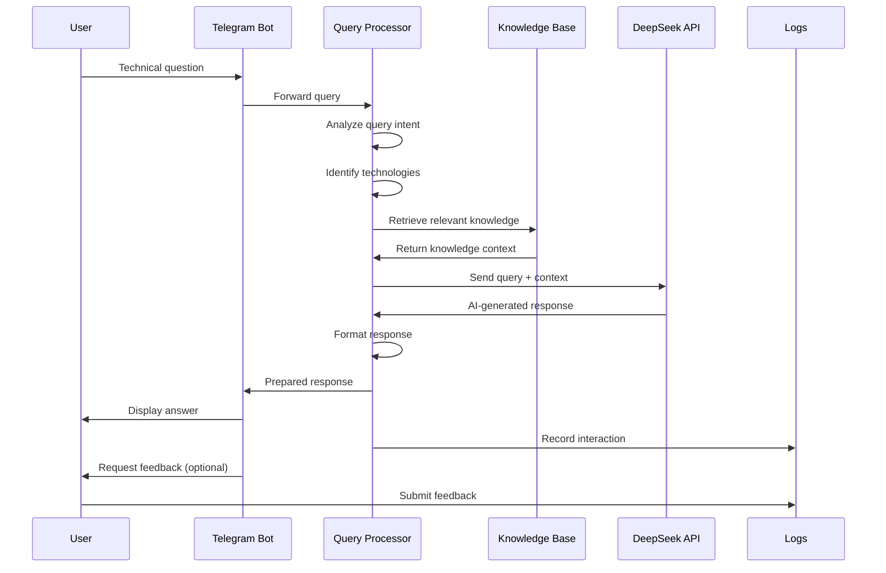

# Telegram AI Support Bot - Design Document

## Project Overview

### Purpose
Development of an AI-powered Telegram support bot for IT company employees, utilizing DeepSeek API to provide technical assistance based on company's technology stack knowledge base.

### Business Goals
- Provide instant technical support to company employees
- Reduce response time for common technical questions
- Centralize knowledge about technology stacks used in company projects
- Ensure secure access through company email verification

### Scope
The system will handle employee authentication, process technical queries through Telegram interface, and generate intelligent responses based on company-specific technology knowledge and DeepSeek capabilities.

---

## Business Process Flow

---

## System Architecture

### High-Level Architecture

### Component Descriptions

| Component | Responsibility | Key Functions |
|-----------|---------------|---------------|
| Telegram Bot Handler | Interface with Telegram platform | Receive messages, send responses, handle commands |
| Authentication Module | Verify user identity | Email verification, session management, access control |
| Query Processor | Analyze and categorize user queries | Extract intent, identify relevant technology stack, prepare context |
| Knowledge Base Manager | Manage technology documentation | Store, retrieve, and update technology stack information |
| Response Generator | Create intelligent responses | Integrate DeepSeek API, format responses, handle errors |
| User Database | Store user information | Verified users, access permissions, user preferences |
| Knowledge Base | Store technical documentation | Technology guides, best practices, troubleshooting steps |
| Interaction Logs | Track bot usage | Query history, response quality, system analytics |

---

## Functional Requirements

### FR-1: User Authentication and Authorization

#### FR-1.1: Email Verification Process
- System shall support verification through company domain email addresses
- System shall generate time-limited verification codes
- System shall send verification codes via email
- System shall validate verification codes within expiration period
- System shall maintain verified user sessions

#### FR-1.2: Access Control
- Only verified users shall interact with bot functionality
- Unverified users shall only access verification commands
- System shall support session expiration and re-verification
- System shall allow administrators to revoke user access

### FR-2: Message Handling

#### FR-2.1: User Query Processing
- System shall receive text messages from Telegram users
- System shall support multi-message conversations
- System shall maintain conversation context
- System shall handle different query types (questions, troubleshooting, how-to)

#### FR-2.2: Query Analysis
- System shall identify technology stack mentioned in query
- System shall extract key technical terms and concepts
- System shall categorize query type (installation, configuration, troubleshooting, best practices)

### FR-3: AI Response Generation

#### FR-3.1: DeepSeek Integration
- System shall send user queries to DeepSeek API
- System shall include relevant knowledge base context in API requests
- System shall handle API rate limits and errors
- System shall support streaming or batch response modes

#### FR-3.2: Response Formatting
- System shall format AI responses for Telegram display
- System shall support code snippets with syntax highlighting
- System shall include relevant links and references
- System shall handle long responses with pagination or file attachments

### FR-4: Knowledge Base Management

#### FR-4.1: Technology Stack Coverage
The system shall maintain knowledge about following technology areas:

| Category | Technologies |
|----------|-------------|
| Orchestration | Ansible, Kubernetes, Openshift, Puppet |
| Containerization | Docker, Docker Swarm, Docker Compose |
| Infrastructure as Code | Terraform |
| CI/CD | Argo CD, GitLab CI |
| Monitoring & Logging | ELK Stack, Zabbix, Grafana, Prometheus |
| Databases | MySQL, PostgreSQL |
| Networking | Cisco, Mikrotik, Keenetic, General networking |
| Operating Systems | Linux Administration, Windows Administration |
| Programming | Python |
| System Administration | General sysadmin practices |

#### FR-4.2: Knowledge Updates
- System shall support adding new technology documentation
- System shall support updating existing technology information
- System shall version knowledge base changes
- System shall allow administrators to review and approve knowledge updates

### FR-5: Bot Commands

| Command | Purpose | Access Level |
|---------|---------|--------------|
| /start | Initialize bot interaction, trigger verification if needed | All users |
| /verify | Start email verification process | Unverified users |
| /help | Display available commands and usage guide | Verified users |
| /status | Check verification status | All users |
| /feedback | Submit feedback about bot response | Verified users |
| /admin_add_knowledge | Add new technology documentation | Administrators |
| /admin_list_users | View verified users | Administrators |

---

## Non-Functional Requirements

### NFR-1: Performance
- Response time for simple queries: within 5 seconds
- Response time for complex queries: within 15 seconds
- System shall support concurrent conversations with multiple users
- System shall handle at least 100 concurrent users

### NFR-2: Security
- All communication with Telegram API shall use HTTPS
- Verification codes shall expire after 15 minutes
- User sessions shall expire after 30 days of inactivity
- Sensitive data (API keys, tokens) shall be stored securely
- System shall not log sensitive user information

### NFR-3: Reliability
- System uptime: 99.5% availability
- System shall gracefully handle DeepSeek API failures
- System shall implement retry mechanism for failed API calls
- System shall provide fallback responses when AI service unavailable

### NFR-4: Maintainability
- Knowledge base shall be easily updatable without code changes
- System shall support configuration through environment variables
- System shall maintain comprehensive logs for debugging
- Code shall follow Python best practices and style guides

### NFR-5: Scalability
- Knowledge base shall support unlimited technology entries
- System shall handle growing number of verified users
- System shall support horizontal scaling for increased load

---

## Data Models

### User Profile

| Field | Type | Description | Constraints |
|-------|------|-------------|-------------|
| telegram_id | Integer | Unique Telegram user identifier | Primary key, required |
| username | String | Telegram username | Optional |
| email | String | Verified company email address | Required, unique, domain-validated |
| verification_status | Enum | User verification state | Values: pending, verified, revoked |
| verification_code | String | Current verification code | Nullable, expires after 15 min |
| verification_code_expires_at | Timestamp | Verification code expiration time | Nullable |
| verified_at | Timestamp | Time of successful verification | Nullable |
| last_interaction | Timestamp | Last message timestamp | Auto-updated |
| created_at | Timestamp | Account creation time | Auto-generated |

### Knowledge Entry

| Field | Type | Description | Constraints |
|-------|------|-------------|-------------|
| entry_id | String | Unique identifier for knowledge entry | Primary key, required |
| technology_name | String | Name of technology | Required, indexed |
| category | Enum | Technology category | Required, predefined categories |
| content | Text | Detailed documentation and guidelines | Required |
| keywords | Array | Search keywords for retrieval | Indexed |
| version | Integer | Version number for tracking updates | Auto-incremented |
| created_by | String | Administrator who created entry | Required |
| created_at | Timestamp | Creation timestamp | Auto-generated |
| updated_at | Timestamp | Last update timestamp | Auto-updated |

### Interaction Log

| Field | Type | Description | Constraints |
|-------|------|-------------|-------------|
| log_id | String | Unique log identifier | Primary key, required |
| telegram_id | Integer | User identifier | Foreign key, required |
| query | Text | User's original question | Required |
| response | Text | Bot's response | Required |
| technologies_identified | Array | Technologies detected in query | Optional |
| deepseek_tokens_used | Integer | API tokens consumed | Required |
| response_time_ms | Integer | Time to generate response | Required |
| user_feedback | Enum | User satisfaction rating | Values: helpful, not_helpful, null |
| timestamp | Timestamp | Interaction timestamp | Auto-generated |

---

## Integration Points

### Telegram Bot API

**Purpose**: Primary interface for user interactions

**Integration Method**: HTTP polling or webhooks

**Key Operations**:
- Receive incoming messages
- Send text responses
- Send formatted messages with markdown
- Handle callback queries for interactive elements

**Error Handling**:
- Retry failed message sends up to 3 times
- Log all API errors for monitoring
- Notify administrators of prolonged outages

### DeepSeek API

**Purpose**: Generate AI-powered responses to technical queries

**Integration Method**: HTTPS REST API

**Request Structure**:
- Include user query as prompt
- Attach relevant knowledge base context
- Specify response parameters (temperature, max tokens)
- Set system role to technical support assistant

**Response Handling**:
- Parse and validate API response
- Extract relevant information from response
- Format for Telegram display
- Handle rate limiting with exponential backoff

**Error Scenarios**:
| Error Type | Handling Strategy |
|------------|-------------------|
| Rate limit exceeded | Queue request, retry with delay |
| API timeout | Return fallback message, log incident |
| Invalid API key | Alert administrator, halt service |
| Malformed response | Request regeneration, use fallback |

### Email Service (SMTP)

**Purpose**: Send verification codes to company email addresses

**Integration Method**: SMTP protocol

**Email Template Requirements**:
- Professional company branding
- Clear verification code display
- Expiration time notice
- Instructions for verification process

**Security Requirements**:
- Use TLS encryption for email transmission
- Validate email domain against company domain whitelist
- Rate limit verification emails per user

---

## Workflow Specifications

### Email Verification Workflow

### Query Processing Workflow

---

## Knowledge Base Structure

### Technology Documentation Format

Each technology entry shall follow structured format:

**Overview Section**:
- Brief description of technology
- Primary use cases within company
- Version information if applicable

**Common Tasks Section**:
- Installation procedures
- Configuration guidelines
- Integration with other company tools

**Troubleshooting Section**:
- Common issues and solutions
- Error messages and meanings
- Debugging approaches

**Best Practices Section**:
- Company-specific guidelines
- Security considerations
- Performance optimization tips

**Resources Section**:
- Official documentation links
- Internal wiki references
- Training materials

### Knowledge Retrieval Strategy

**Keyword Matching**:
- Extract technical terms from user query
- Match against knowledge base keywords
- Rank entries by relevance

**Category Filtering**:
- Identify technology category from query context
- Filter knowledge entries by category
- Prioritize exact category matches

**Context Selection**:
- Limit context size to optimize API token usage
- Select most relevant 2-3 knowledge entries
- Include cross-references for related technologies

---

## Configuration Management

### Environment Variables

| Variable | Purpose | Example Value | Required |
|----------|---------|---------------|----------|
| TELEGRAM_BOT_TOKEN | Telegram bot authentication | 123456:ABC-DEF... | Yes |
| DEEPSEEK_API_KEY | DeepSeek API authentication | sk-... | Yes |
| DEEPSEEK_API_URL | DeepSeek API endpoint | https://api.deepseek.com | Yes |
| DATABASE_URL | Database connection string | postgresql://... | Yes |
| SMTP_HOST | Email server host | smtp.company.com | Yes |
| SMTP_PORT | Email server port | 587 | Yes |
| SMTP_USER | Email authentication username | bot@company.com | Yes |
| SMTP_PASSWORD | Email authentication password | *** | Yes |
| COMPANY_EMAIL_DOMAIN | Allowed email domain | company.com | Yes |
| VERIFICATION_CODE_TTL | Code expiration time (minutes) | 15 | No |
| SESSION_TTL_DAYS | User session duration | 30 | No |
| MAX_CONCURRENT_USERS | Concurrent user limit | 100 | No |
| LOG_LEVEL | Logging verbosity | INFO | No |

### Feature Flags

| Flag | Purpose | Default |
|------|---------|---------|
| ENABLE_EMAIL_VERIFICATION | Toggle email verification requirement | true |
| ENABLE_FEEDBACK_COLLECTION | Toggle user feedback feature | true |
| ENABLE_ADMIN_COMMANDS | Toggle administrative commands | true |
| ENABLE_RESPONSE_STREAMING | Stream responses for long answers | false |

---

## Deployment Considerations

### Infrastructure Requirements

**Runtime Environment**:
- Python 3.9 or higher
- Persistent storage for databases
- Outbound HTTPS connectivity for APIs
- SMTP connectivity for email

**Resource Estimates**:
- CPU: 2 cores minimum
- RAM: 4GB minimum
- Storage: 20GB minimum (logs and database)
- Network: Stable internet connection

**Deployment Options**:
- Container deployment (Docker)
- Kubernetes orchestration for scalability
- Cloud hosting (AWS, GCP, Azure)
- On-premises server deployment

### Monitoring and Observability

**Key Metrics**:
- Message processing rate
- Average response time
- DeepSeek API success rate
- Verification success rate
- Active user count
- Knowledge base utilization

**Logging Requirements**:
- All user interactions (anonymized if needed)
- API call results and errors
- Authentication events
- System errors and warnings
- Performance metrics

**Alerting Triggers**:
- DeepSeek API failure rate > 10%
- Average response time > 20 seconds
- System error rate > 5%
- Email delivery failures
- Database connection issues

---

## Security Considerations

### Authentication Security
- Verification codes shall be cryptographically random
- Codes shall be single-use only
- Failed verification attempts shall be rate-limited
- Suspicious activity shall trigger alerts

### Data Protection
- Personal data shall be minimized
- API keys shall never be logged
- Database shall be encrypted at rest
- Communications shall use TLS encryption

### Access Control
- Administrative functions shall require separate authentication
- Company email domain whitelist shall be strictly enforced
- User permissions shall be validated on every request
- Session tokens shall be securely generated and stored

### API Security
- DeepSeek API key shall be rotated periodically
- API rate limits shall be enforced
- Input sanitization shall prevent injection attacks
- Output validation shall prevent malicious content

---

## Future Extensibility

### Knowledge Base Expansion
- Support for multimedia content (diagrams, videos)
- Automated knowledge import from company documentation
- Version control integration for documentation updates
- Community contributions from verified users

### Enhanced AI Capabilities
- Multi-language support for international teams
- Conversation memory for multi-turn dialogues
- Personalized responses based on user role
- Proactive suggestions based on common issues

### Integration Opportunities
- Integration with company ticketing system
- Connection to internal knowledge management systems
- Integration with CI/CD pipelines for deployment support
- Calendar integration for scheduled maintenance alerts

### Analytics and Insights
- Query pattern analysis
- Technology usage statistics
- Knowledge gap identification
- Bot effectiveness metrics dashboard

---

## Assumptions and Dependencies

### Assumptions
- Company employees have Telegram accounts
- Company email system supports SMTP for verification
- DeepSeek API provides sufficient quality for technical support
- Network connectivity is stable and reliable
- Users are comfortable with English interface

### External Dependencies
- Telegram Bot API availability and stability
- DeepSeek API service availability
- Company email service availability
- Internet connectivity for all services

### Internal Dependencies
- Availability of initial knowledge base content
- Administrator availability for knowledge curation
- Definition of company email domain whitelist
- IT infrastructure for bot hosting

---

## Risk Assessment

| Risk | Impact | Likelihood | Mitigation Strategy |
|------|--------|------------|---------------------|
| DeepSeek API service disruption | High | Medium | Implement fallback responses, cache common answers |
| Unauthorized access attempts | High | Medium | Strong email verification, rate limiting, monitoring |
| Poor AI response quality | Medium | Medium | Knowledge base refinement, response review process |
| Email delivery failures | Medium | Low | Multiple retry attempts, alternative verification method |
| Knowledge base becomes outdated | Medium | High | Regular review schedule, automated update reminders |
| Excessive API costs | Medium | Low | Token usage monitoring, response length limits |
| Database corruption | High | Low | Regular backups, redundancy |
| Privacy concerns | High | Low | Minimize data collection, clear privacy policy |

---

## Success Criteria

### Technical Success Metrics
- Bot successfully processes 95% of queries without errors
- Average response time under 10 seconds
- Email verification success rate > 90%
- System uptime > 99%

### Business Success Metrics
- Employee adoption rate > 60% within 3 months
- Positive feedback rate > 75%
- Reduction in support ticket volume by 20%
- Average user satisfaction score > 4/5

### Knowledge Base Quality Metrics
- Coverage of all 19 technology areas
- Knowledge entries reviewed and updated quarterly
- User-reported accuracy rate > 85%

---

## Implementation Phases

### Phase 1: Core Infrastructure (Foundation)
- Set up Telegram bot connection
- Implement basic message handling
- Create database schema
- Deploy email verification system
- Establish secure configuration management

### Phase 2: AI Integration (Intelligence)
- Integrate DeepSeek API
- Implement query processing logic
- Create response formatting system
- Build error handling and fallback mechanisms

### Phase 3: Knowledge Base (Content)
- Design knowledge storage structure
- Populate initial technology documentation
- Implement knowledge retrieval algorithms
- Create administrative tools for knowledge management

### Phase 4: Testing and Refinement (Quality)
- Conduct user acceptance testing
- Refine AI prompts based on response quality
- Optimize performance and response times
- Implement monitoring and logging

### Phase 5: Production Launch (Deployment)
- Deploy to production environment
- Onboard initial user group
- Monitor system performance
- Gather user feedback

### Phase 6: Enhancement (Evolution)
- Expand knowledge base based on usage patterns
- Add requested features
- Optimize AI response quality
- Scale infrastructure as needed- Optimize AI response quality
