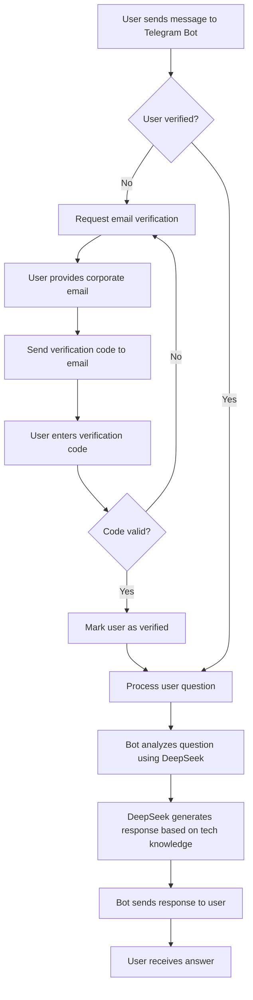
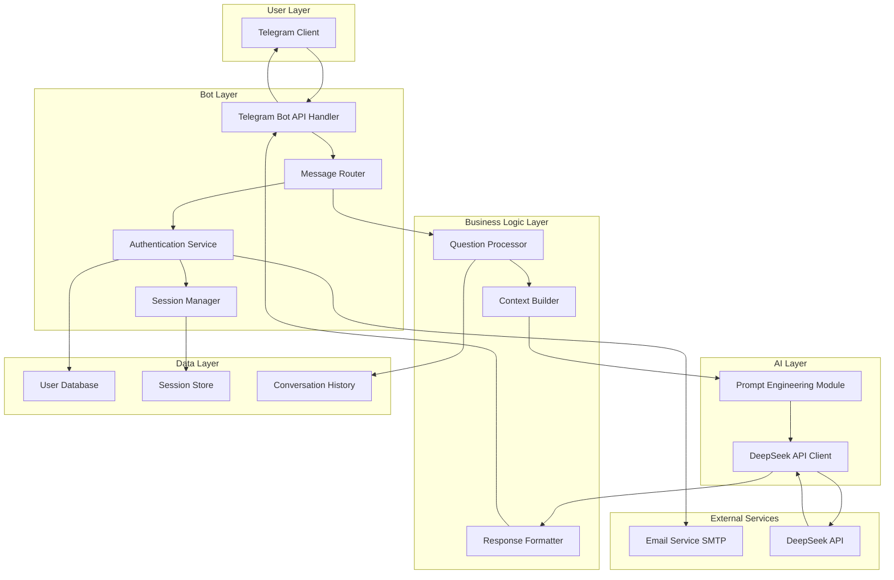
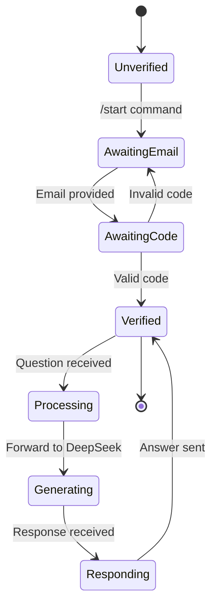

# Telegram Support Bot for IT Company - Design Document

## Project Overview

### Purpose
A Telegram-based AI support bot powered by DeepSeek to assist company employees with technical questions related to technology stacks used in projects.

### Core Objectives
- Provide instant technical support to verified company employees
- Leverage DeepSeek AI knowledge base specialized in company technology stacks
- Ensure secure access through email-based verification
- Reduce response time for common technical questions

### Target Users
Internal company employees with corporate email accounts

---

## Business Process Flow

---

## Functional Requirements

### User Authentication & Verification

#### Email Verification Process
- Users must verify their identity using corporate email domain
- Verification workflow includes:
  - User initiates conversation with bot
  - Bot detects unverified user
  - Bot requests corporate email address
  - System generates unique verification code
  - Verification code sent to provided email
  - User submits code back to bot
  - Bot validates code and grants access

#### User Session Management
- Maintain verified user status persistently
- Link Telegram user ID with verified email
- Support re-verification if needed
- Handle session expiration policies

### Core Bot Functionality

#### Message Processing
- Accept text-based questions from verified users
- Parse and understand user intent
- Maintain conversation context for follow-up questions
- Handle multi-turn conversations

#### DeepSeek Integration
- Send user questions to DeepSeek API
- Include technology stack context in prompts
- Receive AI-generated responses
- Format responses for Telegram delivery

#### Knowledge Specialization
The bot must be knowledgeable in the following technology areas:
- Infrastructure as Code: Ansible, Terraform, Puppet
- Container Orchestration: Kubernetes, Openshift, Docker
- CI/CD: Argo CD, Gitlab CI
- Programming: Python
- Networking: Cisco, Mikrotik, Keenetic, general network technologies
- System Administration: Linux, Windows
- Monitoring & Logging: ELK Stack, Zabbix, Grafana, Prometheus
- Databases: MySQL, PostgreSQL

---

## Technical Architecture

### System Components

### Component Responsibilities

#### Telegram Bot API Handler
- Receive incoming messages from Telegram
- Send responses back to users
- Handle Telegram-specific message formatting
- Manage bot commands and interactions

#### Authentication Service
- Validate corporate email domains
- Generate verification codes
- Send verification emails
- Verify submitted codes
- Manage user registration

#### Session Manager
- Track verified users
- Store user-telegram ID mappings
- Handle session lifecycle
- Enforce access control

#### Question Processor
- Analyze incoming questions
- Categorize question topics
- Extract key technical terms
- Prepare questions for AI processing

#### Context Builder
- Construct system prompts with technology stack knowledge
- Include relevant documentation snippets
- Maintain conversation history
- Build contextual information for DeepSeek

#### DeepSeek API Client
- Interface with DeepSeek API
- Send prompts with technical context
- Receive and parse AI responses
- Handle API errors and retries

#### Response Formatter
- Format DeepSeek responses for Telegram
- Apply message length limits
- Add formatting (code blocks, lists)
- Include helpful links or references

---

## Data Models

### User Record

| Field | Type | Description |
|-------|------|-------------|
| telegram_user_id | Integer | Unique Telegram user identifier |
| email | String | Verified corporate email address |
| verification_status | Boolean | Whether user is verified |
| verification_code | String | Temporary code for verification |
| code_expiration | Timestamp | When verification code expires |
| verified_at | Timestamp | When user completed verification |
| created_at | Timestamp | User record creation time |
| last_active | Timestamp | Last interaction with bot |

### Conversation Session

| Field | Type | Description |
|-------|------|-------------|
| session_id | String | Unique session identifier |
| telegram_user_id | Integer | Reference to user |
| messages | List | Array of message objects |
| started_at | Timestamp | Session start time |
| last_message_at | Timestamp | Last message timestamp |
| is_active | Boolean | Session activity status |

### Message Record

| Field | Type | Description |
|-------|------|-------------|
| message_id | String | Unique message identifier |
| session_id | String | Reference to session |
| role | Enum | "user" or "assistant" |
| content | Text | Message content |
| timestamp | Timestamp | Message creation time |
| tokens_used | Integer | API tokens consumed |

---

## Bot Workflow States

---

## Integration Points

### Telegram Bot API
- **Purpose**: Communicate with Telegram platform
- **Operations**:
  - Receive webhook events for new messages
  - Send text messages to users
  - Handle bot commands
  - Manage bot settings

### DeepSeek API
- **Purpose**: Generate AI-powered responses
- **Operations**:
  - Submit question with technical context
  - Receive generated answer
  - Handle streaming responses (if applicable)
  - Manage API rate limits

### Email Service
- **Purpose**: Send verification emails
- **Operations**:
  - Send verification code to corporate email
  - Validate email delivery
  - Handle bounce/error notifications

---

## Security & Access Control

### Email Domain Verification
- Whitelist of approved corporate email domains
- Validation of email format and domain
- Prevention of disposable email services
- Rate limiting on verification attempts

### Data Protection
- Encrypted storage of user data
- Secure handling of verification codes
- No storage of sensitive company information
- Compliance with data retention policies

### API Security
- Secure storage of API keys (Telegram, DeepSeek)
- Environment-based configuration
- API request signing where applicable
- Rate limiting and quota management

---

## Technology Stack Knowledge Base

### Knowledge Domain Coverage

The bot specialization covers these technology areas with associated scope:

| Technology Area | Key Topics | Knowledge Depth |
|----------------|------------|-----------------|
| Ansible | Playbooks, roles, inventory management, best practices | Advanced |
| Kubernetes | Deployments, services, ingress, troubleshooting | Advanced |
| Docker | Containers, images, compose, networking | Advanced |
| Terraform | Resource provisioning, state management, modules | Advanced |
| Puppet | Manifests, modules, configuration management | Intermediate |
| Python | Scripting, automation, common libraries | Intermediate |
| Openshift | Platform operations, differences from K8s | Intermediate |
| Argo CD | GitOps workflows, deployment strategies | Intermediate |
| Gitlab CI | Pipeline configuration, CI/CD practices | Intermediate |
| Network Technologies | Routing, switching, protocols, troubleshooting | Advanced |
| Linux Administration | System management, services, security | Advanced |
| Windows Administration | Server management, Active Directory, PowerShell | Intermediate |
| Cisco | Router/switch configuration, IOS commands | Intermediate |
| Mikrotik | RouterOS, configurations, scripting | Intermediate |
| Keenetic | Router setup, features, troubleshooting | Basic |
| System Administration | General sysadmin tasks, monitoring, backups | Advanced |
| ELK Stack | Elasticsearch, Logstash, Kibana setup | Intermediate |
| Zabbix/Grafana/Prometheus | Monitoring setup, alerting, dashboards | Intermediate |
| MySQL/PostgreSQL | Database administration, queries, optimization | Intermediate |

### Prompt Engineering Strategy

The system must construct prompts for DeepSeek that:
- Establish the bot's role as an IT support specialist
- Include technology context relevant to the question
- Reference company-specific practices when applicable
- Request practical, actionable answers
- Maintain professional tone
- Encourage best practices and secure solutions

---

## User Interaction Design

### Bot Commands

| Command | Purpose | Available To |
|---------|---------|--------------|
| /start | Initiate bot interaction, begin verification | All users |
| /verify | Start or restart verification process | Unverified users |
| /help | Display help information and capabilities | Verified users |
| /new | Start new conversation context | Verified users |
| /status | Check verification status | All users |

### Conversation Flow Examples

#### First-time User Flow
1. User sends `/start`
2. Bot responds with welcome message and verification request
3. User provides corporate email
4. Bot confirms email sent
5. User receives verification code via email
6. User submits code
7. Bot confirms verification success
8. User can now ask technical questions

#### Verified User Flow
1. User sends technical question
2. Bot acknowledges and processes
3. Bot returns AI-generated answer
4. User can ask follow-up questions
5. Context maintained throughout conversation

---

## Error Handling & Edge Cases

### Verification Errors
- Invalid email format: Request correction
- Non-corporate domain: Inform user of requirement
- Expired verification code: Offer to resend
- Too many failed attempts: Temporary lockout

### API Errors
- DeepSeek API unavailable: Inform user, retry mechanism
- Rate limit exceeded: Queue request or notify user
- Invalid response: Fallback message, log for review
- Timeout: Cancel and inform user

### User Input Errors
- Empty messages: Request valid question
- Unsupported content types: Accept text only
- Excessive message length: Request concise question

---

## Performance Considerations

### Response Time Expectations
- Verification code generation: < 2 seconds
- Email delivery: < 30 seconds
- DeepSeek response: 5-15 seconds
- Message delivery to user: < 1 second

### Scalability Requirements
- Support concurrent conversations from multiple users
- Handle message queue during high load
- Manage DeepSeek API rate limits
- Scale database connections as needed

### Resource Management
- Limit conversation history retention
- Clean up expired verification codes
- Manage session timeout
- Optimize API token usage

---

## Monitoring & Observability

### Key Metrics to Track
- Number of active verified users
- Verification success rate
- Average response time
- DeepSeek API usage and costs
- Error rates by type
- Question categories and frequency
- User engagement metrics

### Logging Requirements
- All verification attempts
- API calls and responses
- Error events with context
- User interactions (privacy-compliant)
- System health indicators

---

## Deployment Considerations

### Environment Configuration
- Development environment for testing
- Staging environment for validation
- Production environment for live users
- Configuration management for different environments

### Required Credentials
- Telegram Bot Token (from BotFather)
- DeepSeek API Key
- Email service credentials (SMTP)
- Database connection strings
- Environment-specific secrets

### Infrastructure Needs
- Application hosting platform
- Database service
- Persistent storage for logs
- Network connectivity to external APIs
- SSL/TLS certificates for secure communication

---

## Future Enhancement Opportunities

### Potential Features
- Multi-language support
- Voice message processing
- Document/image analysis for troubleshooting
- Integration with ticketing systems
- Analytics dashboard for administrators
- Feedback collection on answer quality
- Custom knowledge base contributions
- Team-specific bot instances
- Advanced context from project repositories

### Knowledge Expansion
- Regular updates with new technology versions
- Integration with internal documentation
- Learning from resolved tickets
- Community-contributed solutions
- Technology stack updates as company evolves- Community-contributed solutions
